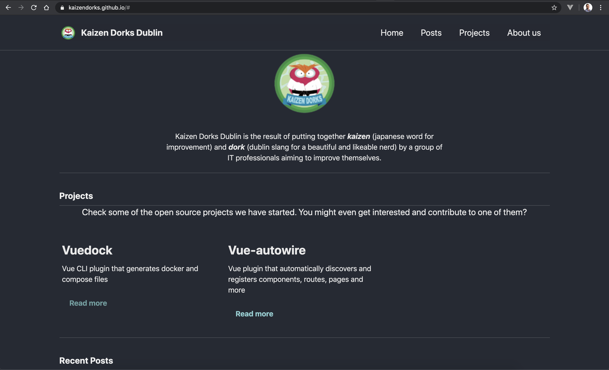
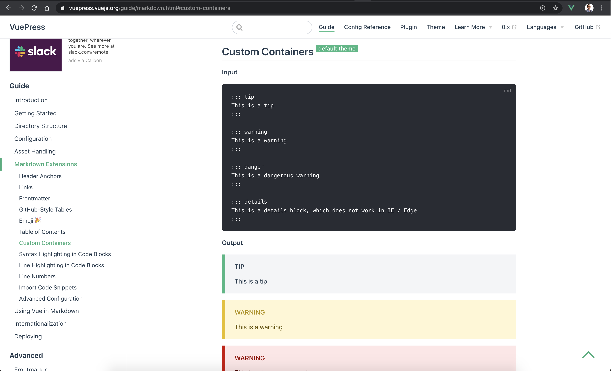
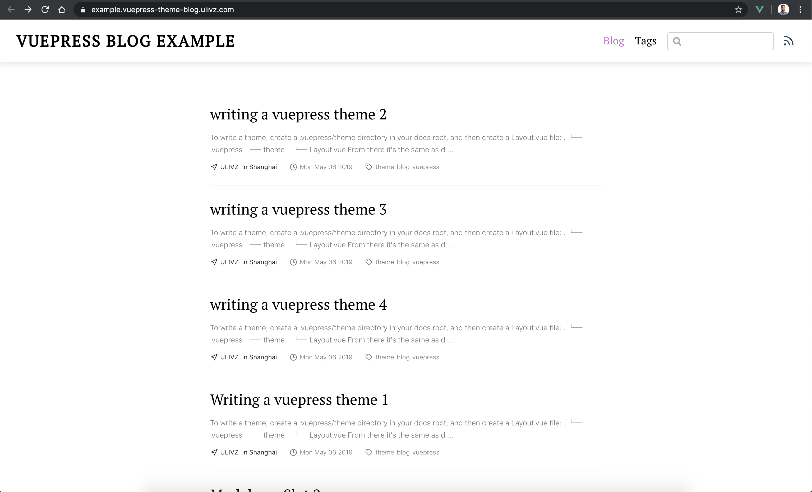

# A new website for Kaizen Dorks

I have been postponing the moment to rewrite the Kaizen Dorks website far too long.

It's been roughly a year (13 months according to the [GitHub history](https://github.com/kaizendorks/kaizendorks.github.io/commit/45a134dc01de75639495b02b4ce2c2f7b2ee37a0)) since I created the initial version of the website using Jekyll.

It is mostly my fault that it barely got past the initial commit and never had much content! I was meant to keep exploring Jekyll and finish the basic functionality of the website, i.e. a place where we can showcase our projects, host our tutorials and publish blog entries. However, I wasn't finding the motivation to go deeper with my choice of Jekyll, nor liking much [the template](https://github.com/mmistakes/minimal-mistakes) I had initially chosen.

It is in these covid days that I finally found the motivation to go back, rewrite the website and fill it with some initial content. As a way of keeping one's head further from the covid talk, it worked really well. But it was also long due having a website where the good work we have done in little over a year could be showcased!

## Initial website contents

When you look back, since the beginning of 2019 we have published:
- 6 npm [packages](/tag/npm/)
- 1 PyPI [package](/tag/PyPI/)
- 1 Docker [image](/tag/Docker%20Hub/)
- 1 in-depth [tutorial](/tutorials/kubernetes/)

This might be awesome or mundane depending on who reads. However no one could really see it! We are proud of our results, achieved outside of work in areas of our interest, but there wasn't a place that we could come back to clearly see that work.

And not only that, most of the work we do is something _we feel_ it would be useful to share with others. Publishing a library no one needs or a tutorial that no one reads would be a wasteful exercise.

I hope this website helps us both showcase what we done and share it with others!

## The website stack

You might wonder why haven't I simply added those contents to the previous website? Let me briefly talk about that.

### Abandoning Jekyll

I created the first version of the website using [Jekyll](https://jekyllrb.com/) because _I wanted_. Jekyll was new to me, so it was an excuse to finally get a deeper look at it and try something other than a hello world exercise. It is also one of the most recommended solutions to create static sites, and is easy to come across documentation that uses it to create a [GitHub pages](https://help.github.com/en/articles/setting-up-your-github-pages-site-locally-with-jekyll) website.

::: tip
Jekyll popularized the concept of _static site generators_ and was the first solution adopted by GitHub pages.
:::

However I must admit I never really got into it. It felt like a chore, and after having used [vuepress](https://vuepress.vuejs.org/) to build various documentation sites, it also felt _old_. It could very well be my fault, that I didn't put enough effort to learn it, or simply that I am way too much used to Vue after 4 years using it.

One way or another, I wasn't enjoying what I was doing, and this was meant to be fun and enjoyable in the first place!

### The switch to vuepress

Of course I started ignored the website and never couldn't really force myselt to look into it. Until covid came of course, with plenty of time to spend at home!

With plenty of time, I decided to prepare an entry level [Kubernetes worskshop](/tutorials/kubernetes/) that I could share with my colleagues. Once I had finished writing the script I wanted to follow during the workshop, I realized that it was worth sharing it _somewhere_ for anyone to follow at their own pace.

::: tip
Luckily for us, these days GitHub pages support any kind of static site. Which means you can keep using Jekyll, but you can also use any other static site generator such as React's powered [gatsby.js](https://www.gatsbyjs.org/) or Vue's powered [vuepress](https://vuepress.vuejs.org/).
:::

So I decided to finally come back to the Kaizen Dorks website and rewrite it. But using what? While I considered `gatsby.js` for a bit, but I found myself spending mmuch more time reading the docs than I intended to. While I might come back to `gatsby.js` in the future (planning on giving it a go for something simpler, a personal CV type of site for my GitHub account), in the end I decided to use `vuepress`.

Getting a decent site up and running and the content out there was a higher priority goal this time over learning something new!

I was immediately much more productive, but above all, enjoying myself. Knowing Vue well enough, I felt like I could relatively easy add or tweak any functionality, since I can move from markdown to Vue at any time.

However, that's not to say there were not any obstacles and rough edges! I initialized the new site using the [@vuepress/theme-blog](https://vuepress-theme-blog.ulivz.com/) theme, surprised to find it drops some of the elements of the default template. It also felt way too much geared towards a blog, while I wanted something that can contain both articles and documentation/tutorials.

Thus, I decided to bring back some of the [@vuepress/theme-default](https://github.com/vuejs/vuepress/tree/master/packages/%40vuepress/theme-default) theme functionality. Mostly I wanted to add the sidebar and the tip/warning/danger markdown extension, adapting their styling to match the blog theme.

I quite like how easy it is to customize vuepress and to [override/extend themes](https://vuepress.vuejs.org/theme/inheritance.html#motivation). However, it took some reading through both themes' source code before I figured out _what_ to override. Once you step out of the default vuepress theme, the documentation isn't the easiest in the world to navigate!

A couple of days later, with some layout overwritten, some components rescued from the default theme, and a bit of a styling mess, I had what I wanted.

## Plans for the future

Now that the site is ready and feels fresh, I personally have _big plans_ to write and add more content (at least until the novelty or covid fade away, we'll see what comes first 😭)

### New tutorials

It could be interesting to extract a new tutorial from my experience getting static sites in GitHub pages, explorying different static site generators such as [Jekyll](https://jekyllrb.com/), [gatsby.js](https://www.gatsbyjs.org/) and [vuepress](https://vuepress.vuejs.org/).

I am not sure everyone realizes how straightforward it is to get your own site hosted on GitHub pages, or a documentation site, or your professional presentation site. At the same time, publishing a _user repo_ type of GitHub pages is a different mattern from _repo's doc_ type. The [vuepress docs](https://vuepress.vuejs.org/guide/deploy.html#github-pages) does give you the wright publish steps but do not stress the point enough. If you have published doc sites, you might be [caught by surprise](https://dev.to/javascripterika/deploy-a-react-app-as-a-github-user-page-with-yarn-3fka).

After several different [Vue CLI plugins](/tag/Vue%20CLI/), I feel like we could also write another one on how to create, test and publish one of these plugins.

### Article ideas

Creating the site, I realized that [extending](https://vuepress.vuejs.org/theme/inheritance.html#motivation) one of the default [vuepress](https://vuepress.vuejs.org/) themes is easy _once you know the theme you are extending_. The documentation of the themes isn't as easy to consume as the default vuepress documentation, nor won't necessarily tell you the inner details you need to know when extending. A write up on how to do this could be interesting.

I have also been considering to put in writing my approach to create technical documentation. Documentation sadly keeps being an afterthought, specially in many work places, and is not a particularly extended skills. Over the past few years, I have had to create extensive documentation on tools used at work, and I feel like sharing my experience could be interesting. Hopefully someone can avoid some of my mistakes and/or point out things I could do better.

## Sounds interesting?

What started like a brief initial post ended being much longer than intended! I hope that you like the new site, that I keep writing, and that this invites some of the other _dorks_ to add their own content!
