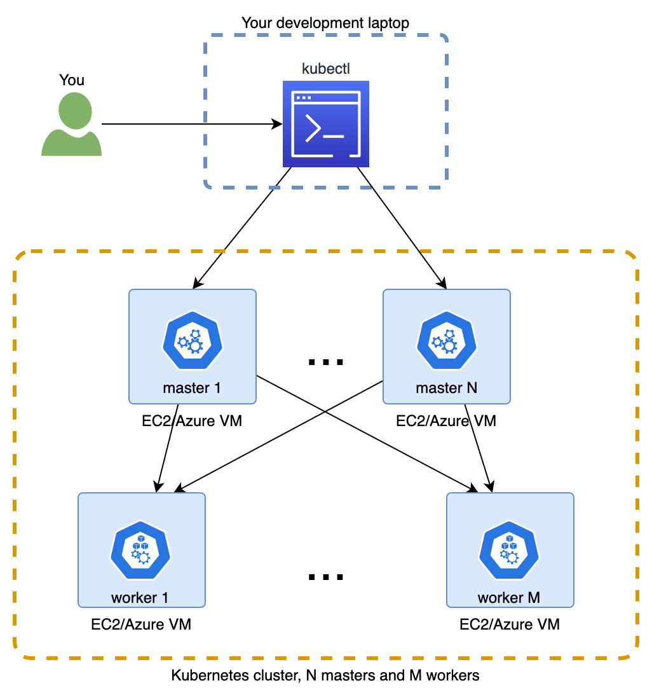
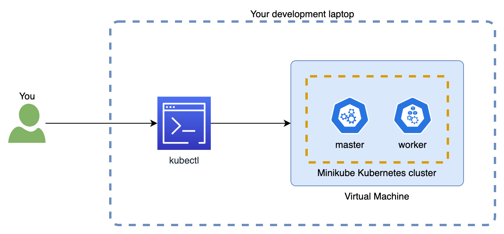
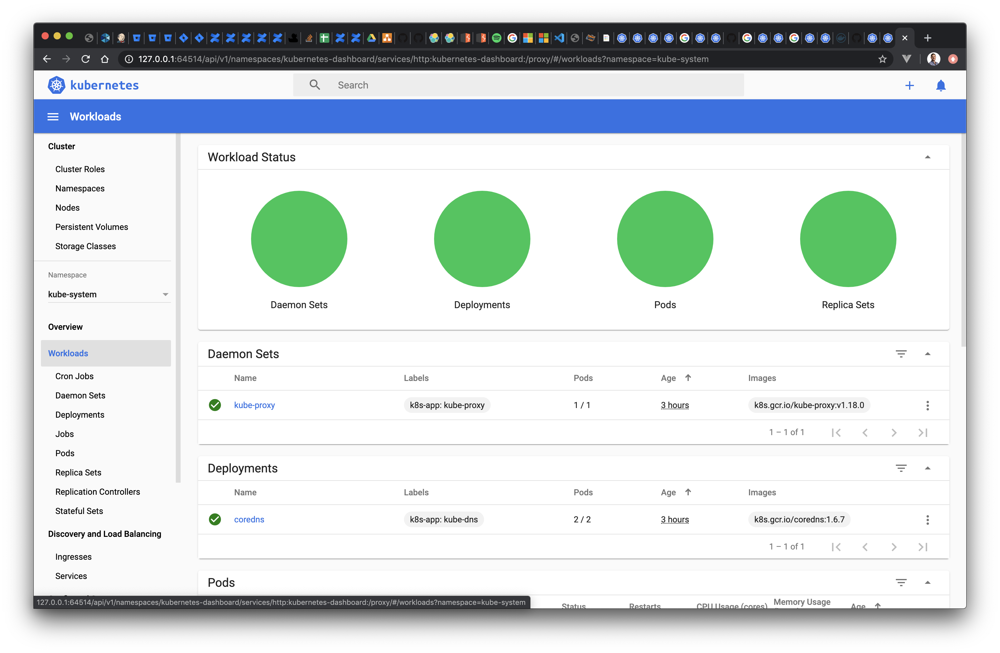
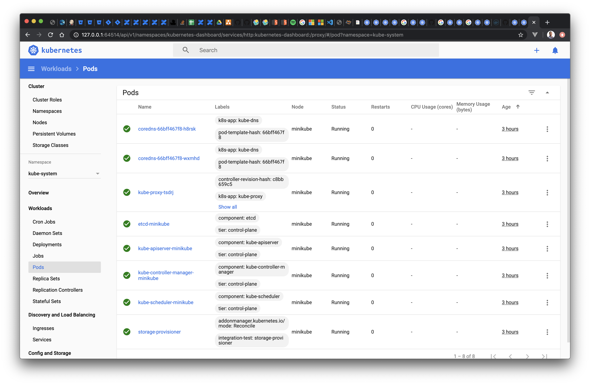

# Clusters and Nodes

Once you have finished installing the required components, you can easily get your local cluster up and running with the `minikube start` command, and you can use `minikube status` to confirm.
```bash{1,5}
$ minikube start
... omitted
🏄  Done! kubectl is now configured to use "minikube"

$ minikube status
m01
host: Running
kubelet: Running
apiserver: Running
kubeconfig: Configured
```

::: tip Running online?
You should have already gone through similar steps by completing the linked [katacoda tutorial](https://www.katacoda.com/courses/kubernetes/launch-single-node-cluster). This means you already have a working cluster using minikube and an shell where you can issue `minikube` and `kubectl` commands.
:::

## Node types

By initializing [minikube](https://github.com/kubernetes/minikube), you should also get [kubectl](https://kubernetes.io/docs/reference/kubectl/overview/) configured in your local machine, so you can issue `kubectl` commands to your local cluster.
- Let's see what the status of the cluster is:
    ```bash{1}
    $ kubectl cluster-info
    Kubernetes master is running at https://192.168.64.3:8443
    KubeDNS is running at https://192.168.64.3:8443/api/v1/namespaces/kube-system/services/kube-dns:dns/proxy

    To further debug and diagnose cluster problems, use 'kubectl cluster-info dump'.
    ```
- Let's also list the nodes in your cluster:
    ```bash{1}
    $ kubectl get nodes
    NAME       STATUS   ROLES    AGE   VERSION
    minikube   Ready    master   37m   v1.18.0
    ```

Good, that means the single node cluster has correctly been configured and is working. It also confirms `kubectl` is correctly configured to interact with that cluster.

Let’s pause for a moment. What do we mean by **cluster**? And by **node**?

Kubernetes clusters are formed by a number of nodes that typically have the role of either **master** or **workers**:
- The workers are the nodes where applications are deployed. This is where the docker containers that form your application actually run.
- While the masters are the nodes you tell what you want to deploy and ensure it actually gets deployed across the workers. While a [number of components](https://kubernetes.io/docs/concepts/overview/components/) make this possible, during the tutorial we will consider each master as a single black box.

## Cluster sizes

Typically, a cluster will have multiple nodes of each type, each of them being an independent machine. This makes your cluster resilient to a number of faults, increasing its *availability*.
- Quite often, these will be VMs (Virtual Machines) provided by services such as AWS, Azure or Google Cloud.
- It is also common to use one of the _Kubernetes as a service_ offerings such as [Amazon's EKS](https://aws.amazon.com/eks/), [Azure's AKS](https://azure.microsoft.com/en-us/services/kubernetes-service/) or [Google's GKE](https://cloud.google.com/kubernetes-engine). These remove some of the heavy lifting involved in setting up the cluster, letting you pick how many machines you need and of which type.



How does this apply to what we have done so far?

Since we are using `minikube`, our cluster is made of a single node that performs all the work by itself, acting with both roles of **master** and **worker**. This node is a virtual machine (VM) running in your laptop, which according to the `cluster-info` output above is located at the local IP `192.168.64.3`



## Exploring the cluster contents

Let's continue this section by exploring the contents of our *empty cluster* (you will see is not so empty) while getting used to some of the `kubectl` and `minikube` commands.

First, let's see what applications or services are currently deployed in the cluster by inspecting its current **Pods**.
For this we will use the `kubectl get` command, which lets you list objects of a given type.

::: tip
Don't worry for now about the concept of `Pod` or the `--all-namespace` argument. We will explore these in the [next module](./2-basic-kubernetes-objects.md)!
:::

```bash{1}
$ kubectl get pod --all-namespaces
NAMESPACE     NAME                               READY   STATUS    RESTARTS   AGE
kube-system   coredns-66bff467f8-6khs7           1/1     Running   0          53m
kube-system   coredns-66bff467f8-w8x67           1/1     Running   0          53m
kube-system   etcd-minikube                      1/1     Running   0          53m
kube-system   kube-apiserver-minikube            1/1     Running   0          53m
kube-system   kube-controller-manager-minikube   1/1     Running   0          53m
kube-system   kube-proxy-m7mrz                   1/1     Running   0          53m
kube-system   kube-scheduler-minikube            1/1     Running   0          53m
kube-system   storage-provisioner                1/1     Running   0          53m
```

Not so empty indeed! Every cluster needs to host several services so Kubernetes can do its work, which is to host your application and services and to expose them so you and other applications/services can interact with them.

## Basic CPU and Memory stats

Next, let's take a look at how well is our cluster performing by checking some basic CPU and Memory stats using the `kubectl top` command.
Before we can do so, you will need to enable an [add-on](https://minikube.sigs.k8s.io/docs/tasks/addons/) for minikube so these metrics are available in your local learning environment.

We can use the `minikube addons` to both see the list of all possible addons and to enable/disable them.
```bash{1}
$ minikube addons list
|-----------------------------|----------|--------------|
|         ADDON NAME          | PROFILE  |    STATUS    |
|-----------------------------|----------|--------------|
| dashboard                   | minikube | disabled     |
| default-storageclass        | minikube | enabled ✅   |
| efk                         | minikube | disabled     |
| freshpod                    | minikube | disabled     |
| gvisor                      | minikube | disabled     |
| helm-tiller                 | minikube | disabled     |
| ingress                     | minikube | disabled     |
| ingress-dns                 | minikube | disabled     |
| istio                       | minikube | disabled     |
| istio-provisioner           | minikube | disabled     |
| logviewer                   | minikube | disabled     |
| metrics-server              | minikube | disabled     |
| nvidia-driver-installer     | minikube | disabled     |
| nvidia-gpu-device-plugin    | minikube | disabled     |
| registry                    | minikube | disabled     |
| registry-aliases            | minikube | disabled     |
| registry-creds              | minikube | disabled     |
| storage-provisioner         | minikube | enabled ✅   |
| storage-provisioner-gluster | minikube | disabled     |
|-----------------------------|----------|--------------|
```

We will enable the **metrics-server** addon. It enables a ligthweight in-memory service (called [metrics-server](https://kubernetes.io/docs/tasks/debug-application-cluster/resource-usage-monitoring/#resource-metrics-pipeline)) that collects the CPU and memory stats:
```bash
$ minikube addons enable metrics-server
```

Once enabled, we can see the CPU/memory stats grouped by node (remember in minikube there is a single node). For this we can use the `kubectl top` command
```bash{1}
$ kubectl top node
NAME       CPU(cores)   CPU%   MEMORY(bytes)   MEMORY%
minikube   218m         10%    1185Mi          31%
```

::: warning
Note the metrics server might take a while to initialize! You will see the output `error: metrics not available yet` if it's still initializing
:::

The same command to see the stats breakdown by Pod
```bash{1}
$ kubectl top pod --all-namespaces
NAMESPACE              NAME                                         CPU(cores)   MEMORY(bytes)
kube-system            coredns-66bff467f8-6khs7                     2m           6Mi
kube-system            coredns-66bff467f8-w8x67                     1m           6Mi
kube-system            etcd-minikube                                24m          38Mi
kube-system            kube-apiserver-minikube                      44m          256Mi
kube-system            kube-controller-manager-minikube             11m          36Mi
kube-system            kube-proxy-m7mrz                             0m           8Mi
kube-system            kube-scheduler-minikube                      2m           9Mi
kube-system            metrics-server-7bc6d75975-pwldm              0m           10Mi
kube-system            storage-provisioner                          0m           14Mi
```

::: tip
Now that you have seen a couple of kubectl commands `kubectl get` and `kubectl top`, you might have noticed a similar pattern used for both commands.

Kubectl offers a consistent API where the same command (ie, `kubectl top`) can be used with different object types (ie, `pod` and `node`). As you continue through the tutorial and get familiar with other kubectl commands, you will appreciate the consistency this brings! It really makes easier to get comfortable with using the `kubectl` CLI.
:::

We have seen the easiest and most basic way to get the CPU and memory stats, which is great. But what do these figures _actually mean_?

- The easiest one is the memory. Since it says (bytes) in the output, you might have correctly guessed 6Mi equals 6 mega bytes
- What about CPU then? It us measured in _milli cores_, meaning a 1000th of a single core of a CPU. So 2m equals 2 milli cores, or a 2/1000 of one of your CPU cores. See the [official docs](https://kubernetes.io/docs/tasks/configure-pod-container/assign-cpu-resource/#cpu-units).

## Enabling the dashboard

We will finish this first section by enabling the [Kubernetes Dashboard](https://kubernetes.io/docs/tasks/access-application-cluster/web-ui-dashboard/) in our minikube cluster. This will be a very helpful tool while learning and experimenting since it will let you explore and interact with your cluster from your browser.

Enable it with the following command:
```bash
$ minikube addons enable dashboard
```

The command will deploy the necessary Kubernetes objects to host the dashboard application. You will for example see new Pods if you run again the `kubectl get pods --all-namespaces` command.

Then open a second terminal and run
```bash
$ minikube dashboard
```

A new browser tab will open with the dashboard! You can now inspect the cluster in the dashboard:


 For example, find all the those `Pods` listed with the previous `kubectl get` command by:
 1. Select the **kube-system** namespace in the dropdown available on the sidebar
 1. Then select the Pods item of the sidebar.

The output should display the same containers you saw in your command line:


And this concludes the initial module of the tutorial.
Feel free to explore further the dashboard, for example accessing the logs of one of those `Pods`, or viewing their properties. While it might not make complete sense, you will be able to connect the dots faster in the next module as we take a deeper look at basic objects such as `Pod` or `Namespace`.

[Prev module](./) | [Next module](./2-basic-kubernetes-objects.md)