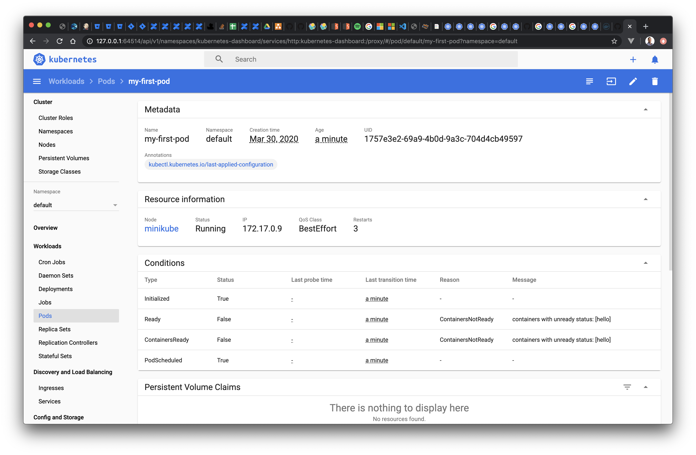
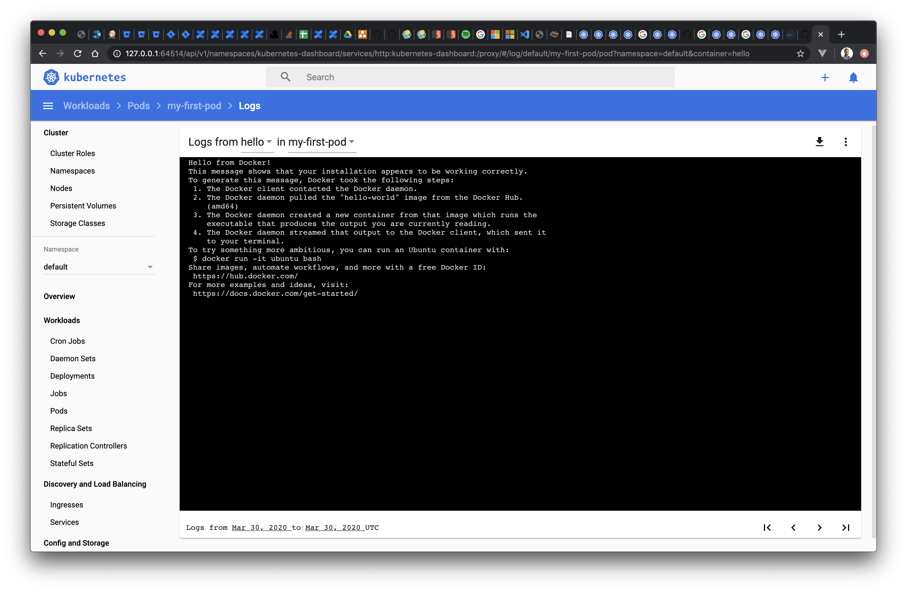
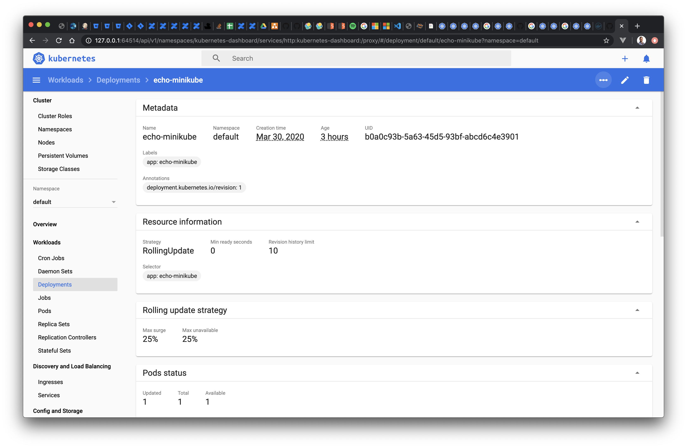

# Basic Kubernetes Objects

The minimum unit of deployment in a Kubernetes cluster is a [Pod](https://kubernetes.io/docs/concepts/workloads/pods/pod-overview/). This might surprise many, since you might have guessed the minimum unit is a docker container! While in many cases a `Pod` is made of a single container, it does not necessarily need to be, and this flexibility allows for some advanced patterns like [init containers](https://kubernetes.io/docs/concepts/workloads/pods/init-containers/) or [sidecar containers](https://kubernetes.io/blog/2015/06/the-distributed-system-toolkit-patterns/).

Furthermore, a `Pod` is just one of the many different Kubernetes objects that you can use to interact with the cluster. During this module we will explore one you have already seen, the `Namespace`, and introduce a third one, the `Deployment`.

::: warning Confused?
Don't worry if this seems initially confusing, you are not alone 😭

During the rest of this tutorial we will keep things simple so you can safely assume _1 Pod == 1 Container_. After all, this is the most common use case in Kubernetes. As you get familiar with Kubernetes, it will be easier to understand how a `Pod` is different from a docker container
:::

## Pods
### Deploying containers using Pods and manifests

We will begin by deploying a very simple container, which is the [hello-world](https://hub.docker.com/_/hello-world) container available in Docker hub. To do so, we need to define the Pod using [YAML](https://en.wikipedia.org/wiki/YAML). The definition of all the Pod properties is known as a **manifest**.
> A manifest is nothing but the definition of a Kubernetes object, in this case a `Pod`, using YAML.

The most basic Pod manifest looks as follows:
```yaml
apiVersion: v1
kind: Pod
metadata:
  name: my-first-pod
spec:
  containers:
  - image: hello-world
    name: hello
```

Such a basic Pod manifest is simply a way of telling Kubernetes which container do we want to deploy as indicated by the `spec` definition:
- The `image` parameter defines which docker container image should be deployed. Of course, Kubernetes need to to know about the docker registry where this image lives so it can pull the image, but since the image `hello-world` lives in the default DockerHub registry, this is not a problem.
- As you can see the YAML structure allows more than one container to be defined as part of a single Pod (note that in the YAML, `containers` is a list). Like we said at the beginning, we will keep things simple and during the tutorial we will use one container per Pod.
- This also means the `name` parameter inside the `spec` is not so interesting, but in cases where each Pod contains more than one container this parameter lets you identify each of them within the Pod.

In addition, the `metadata` section which gives extra information to Kubernetes, such as the `Namespace` this object belongs to and the name of the object. (We will see more on namespaces right in the next section).

You can deploy this `Pod` to your cluster using the `kubectl apply`. There are 2 common ways of doing so:
- You save the manifest to a file such as `my-pod.yaml` and pass the filename to kubectl:
    ```bash
    $ kubectl apply -f my-pod.yaml
    ```
- You inline the YAML definition to kubectl as in:
    ```bash
    $ cat <<EOF | kubectl apply -f -
    apiVersion: v1
    kind: Pod
    metadata:
      name: my-first-pod
    spec:
      containers:
      - image: hello-world
        name: hello
    EOF
    ```
::: tip
Note, you could also use the `kubectl create pod` command. However, `apply` is a more powerful and general command, which will work for any kind of Kubernetes object described by its manifest. We will keep using the `apply` command through the tutorial!
:::

::: warning Do you have trouble pulling images?
This is likely to be due to the [following issue](https://github.com/kubernetes/minikube/issues/4589). Try restarting minikube by running `minikube stop && minikube delete && minikube start` (might take a while to run)
:::

In both cases your should get the confirmation output: `pod/my-first-pod created`. If you want, you can run the usual `kubectl get pod` command to verify:
```bash{1}
$ kubectl get pod my-first-pod
NAME                              READY   STATUS      RESTARTS   AGE
my-first-pod                      0/1     Completed   9          21m
```

Therefore, Kubernetes provides a _declarative interface_. You _declare_ what you want to host in your cluster by listing its properties in these manifests, and Kubernetes will take care of actually doing the work:
- Every time an object is created, like the `Pod` we just created, the definition of that object is added to a distributed database that lives in the master nodes of your cluster, the **etcd database**.
- Kubernetes masters will then do its best to deploy these objects across all the available resources (ie, worker nodes) of your cluster.

::: warning
If your cluster were to lose all of its **worker** nodes, as soon as new VMs replacing the ones you lost are created, the masters will be able to automatically redeploy the same objects!

If you lose all the **masters**, you will lose the ability to manage your cluster (as in deploy, redeploy or inspect existing applications). Once new nodes replace the lost masters, you will then need to restore the **etcd database** from a backup.
:::

We can actually use `kubectl` to inspect the full YAML manifest of any object in your cluster. For example, you can retrieve the manifest we just created with:
```bash
$ kubectl get pod my-first-pod -o yaml
```
:::tip
You will receive a much larger output than the simple manifest you created. Don't worry, those are all default values and/or metadata added by kubernetes and minikube.
:::

We can also see some verbose description in an easier human readable form using the `kubectl describe` command:
```bash
$ kubectl describe pod my-first-pod
```

### Inspecting the Pod status

So far, we have deployed a `Pod` to the cluster. However, how can you be sure that Kubernetes actually _hosted_ and _run_ the container? Ie, we want to verify that our application actually _did run_.

Remember that we deployed a simple `hello-world` container. All it is supposed to do is to to print a message to the console and terminate.

Let's verify that was the case:
- We can see the container is in the terminated state, meaning its main process has already exited:
    ```bash{1}
    $ kubectl get pods
    NAME                              READY   STATUS      RESTARTS   AGE
    my-first-pod                      0/1     Completed   9          21m
    ```
- We can retrieve the standard output from the Pod's container using the `kubectl logs`. We can then verify the expected message was printed to the console:
```bash{1}
$ kubectl logs my-first-pod
Hello from Docker!
This message shows that your installation appears to be working correctly.

To generate this message, Docker took the following steps:
1. The Docker client contacted the Docker daemon.
2. The Docker daemon pulled the "hello-world" image from the Docker Hub.
    (amd64)
3. The Docker daemon created a new container from that image which runs the
    executable that produces the output you are currently reading.
4. The Docker daemon streamed that output to the Docker client, which sent it
    to your terminal.

To try something more ambitious, you can run an Ubuntu container with:
$ docker run -it ubuntu bash

Share images, automate workflows, and more with a free Docker ID:
https://hub.docker.com/

For more examples and ideas, visit:
https://docs.docker.com/get-started/
```

In addition to this, since we have enabled the Kubernetes dashboard in minikube, we can see the the Pod, its status and the logs directly in the browser:



Let's finish the section by cleaning up and removing the `Pod`. We simply use the `kubectl delete` command to remove objects:
```bash
$ kubectl delete pod my-first-pod
```

## Namespaces
### What's a namespace?
Remember the command we run during the Getting Started section in order to see all the Pods contained by our newly initialized cluster?
```bash{1}
$ kubectl get pods --all-namespaces
NAMESPACE     NAME                               READY   STATUS    RESTARTS   AGE
kube-system   coredns-66bff467f8-6khs7           1/1     Running   0          53m
kube-system   coredns-66bff467f8-w8x67           1/1     Running   0          53m
kube-system   etcd-minikube                      1/1     Running   0          53m
kube-system   kube-apiserver-minikube            1/1     Running   0          53m
kube-system   kube-controller-manager-minikube   1/1     Running   0          53m
kube-system   kube-proxy-m7mrz                   1/1     Running   0          53m
kube-system   kube-scheduler-minikube            1/1     Running   0          53m
kube-system   storage-provisioner                1/1     Running   0          53m
```

We used the `all-namespaces` option, which as you can guess, tells `kubectl` to consider any [Namespace](https://kubernetes.io/docs/concepts/overview/working-with-objects/namespaces/) when running the command. Thus, it has found several `Pods` within the **kube-system** Namespace.

If you omit the argument, `kubectl` assumes you mean the _default_ `Namespace`, and you will see the following output (assuming you deleted the hello-world Pod at the end of the earlier section):
```bash{1}
$ kubectl get pods
No resources found.
```

You could also manually provide the name of the `Namespace` you are looking for. Since we know all those `Pods` were in the **kube-system** namespace, you could also list them with any of these 2 commands:
```bash
$ kubectl get pods --namespace kube-system
$ kubectl get pods -n kube-system
```

Similarly, all created objects are assigned to a `Namespace`. Every manifest can include a `namespace` property as part of its `metadata` section, which defines the Namespace for that object. And if omitted, the object will be created in the _default_ namespace:
```yaml{5,6}
apiVersion: v1
kind: Pod
metadata:
  name: my-first-pod
  # omit the namespace field and this object will be created in the default namespace!
  namespace: my-namespace
spec:
  containers:
  - image: hello-world
```

So what is a `Namespace`? It is nothing but a way to organize all of the Kubernetes objects, such as a `Pod`. Every time a Kubernetes object is created, you need to specify at least 2 pieces of _metadata_:

- To which `Namespace` it belongs (Where the _default_ namespace will be used when a explicit one is omitted)
- The `name` of the object, which should be unique across the assigned `Namespace`

### Benefits of using Namespaces

Why are `Namespaces` useful? Why does Kubernetes insist in each object belonging to a `Namespace`?

It is an important design choice of Kubernetes, fundamental in enabling or simplifying scenarios such as:

- You can have 2 Pods with the same name (like `webtool`) across different namespaces. This lets you replicate the same application across different tiers using namespaces such as _dev_, _staging_ and _prod_.
- It will let you group under the same `Namespace` all the related objects belonging to a particular application
- It will simplify administration tasks such as _permissions_, _resource management_ or _networking policies_ by defining them at the `Namespace` level rather than per individual object (so it affects all the objects defined in that particular Namespace)

Take your time to understand the basics about `Pods` and `Namespaces`. Alongside `Deployments` (which we will cover next), these are the most fundamental and common objects you will use in Kubernetes to host your applications.

::: tip Namespaces in the tutorial
In order to keep things simple, we will keep using the _default_ Namespace through most of the tutorial. However, anything we do can be applied to specific namespaces by adding the desired namespace to the YAML manifests or kubectl commands.
:::

As an exercise, go back to the previous section, but this time deploy 2 Pods both named `hello-world` into 2 different namespaces
```bash
$ cat <<EOF | kubectl apply -f -
apiVersion: v1
kind: Pod
metadata:
  name: my-first-pod
  namespace: my-namespace1
spec:
  containers:
  - image: hello-world
    name: hello
---
apiVersion: v1
kind: Pod
metadata:
  name: my-first-pod
  namespace: my-namespace2
spec:
  containers:
  - image: hello-world
    name: hello
EOF
```

Notice how:
- The `kubectl get pod` command will not return the created Pods unless you either explicitly provide a namespace (as in `-n my-namespace1`) or all of them (as in `--all-namespaces`)
- The same applies to other `kubectl` commands such as the ones used to retrieve the logs or describe the pods.
- The dashboard shows the Pods under the expected namespaces

Try also to create both Pods in the same namespace and see what happens!

## Deployments

So far we have looked at `Pods`, which are the minimum deployment unit in Kubernetes. However, you will rarely deploy a Pod directly!

Instead you will do so through a [Deployment](https://kubernetes.io/docs/concepts/workloads/controllers/deployment/) object. It is a different type of object, one that _declares_ to Kubernetes how many instances of each Pod would you like to have alive at any point in time. Ie, if one of those Pods fails or terminates, Kubernetes should try to create a new Pod.

> Simplifying a bit, `Pods` and `Deployments` are the equivalent of _objects_ and _classes_ in programming languages.

### Controlling Pods with Deployments

Let's take a look at the most simple example, a `Deployment` object that deploys a single `Pod`.

The Pod will consist of an [HTTP echo server](https://minikube.sigs.k8s.io/docs/examples/) (whose docker image is publicly accessible in google's container registry as part of their minikube examples: `k8s.gcr.io/echoserver:1.4`).

We can define the manifest and pass it directly to `kubectl` in the same way we did to create a `Pod` in the previous sections:
```bash
$ cat <<EOF | kubectl apply -f -
apiVersion: apps/v1
kind: Deployment
metadata:
  name: echo-minikube
spec:
  replicas: 1
  selector:
    matchLabels:
      app: echo-minikube
  template:
    metadata:
      labels:
        app: echo-minikube
    spec:
      containers:
      - image: k8s.gcr.io/echoserver:1.4
        name: echoserver
EOF
```

It looks similar to the `Pod` example we saw earlier, albeit more _complex_:

- The `Deployment` object tells Kubernetes how many `replicas` (ie, _instances_) of the `Pod` should it keep running. In this example, we want a single replica, so we should end up getting a single container once deployed.
- It defines the `Pod` as part of the `template` field. This is pretty much as if you were to paste the full Pod definition we saw earlier, minus its `apiVersion` and `kind` properties.
- You also need to add a `selector`. The selector is a way for Kubernetes to find `Pod` objects based on metadata such as their labels. The reason why you need to define a selector is for Kubernetes to be able to uniquely identify which `Pods` within the `Namespace` belong to a `Deployment`.

::: tip
Defining a `Deployment` with a single `Pod` and a single container is such a common operation that `kubectl` provides a shortcut:
```bash
$ kubectl create deployment echo-minikube --image=k8s.gcr.io/echoserver:1.4
```
:::

You might be wondering, what are the benefits of the increased complexity? After all, we are still deploying a single container! While the benefits will become increasingly obvious as you work more with Kubernetes, let us provide some examples:

- You can now horizontally scale your `Pods` by deploying multiple instances. Combined with `Services` (which we will see in the [next module](./3-basic-networking.md)), you have a simple way to scale and load balance your applications.
- You can also be sure that Kubernetes will do its best effort to always keep the desired number of replicas. In case of failure, or even in case one of the cluster nodes gets removed, Kubernetes can try to create a new replica of the same Pod in any other node. Thus, the number of replicas becomes like a contract with Kubernetes.
- It provides the perfect for Kubernetes to implement patterns such as or _rolling updates_ or _liveness/readiness probes_ can be defined. These patterns give you fine grained control on how your applications are deployed and scaled.

Now that we are done introducing the `Deployment` object, take a moment to inspect the one you just created using the now familiar commands such as `kubectl get deployment` or `kubectl describe deployment`, as well as inspecting it on the dashboard:



Congratulations, you have your first HTTP server deployed in Kubernetes! It's a simple echo server, but the fundamentals you will use to deploy more complex applications are the same.

### Testing an HTTP server deployed with a Deployment

Let's finish this module by verifying that your server is working.

In order to do so, we will find out the IP of the single `Pod` created by this `Deployment`, for example using the web dashboard or the `kubectl describe pod command` (Note that you need to get the name of the pod first, using the `kubectl get pod` command. The actual name of your Pod might vary from the one in the command below)
```bash{1,12}
$ kubectl describe pod echo-minikube-858dcd98d6-wfxzq
Name:               echo-minikube-858dcd98d6-wfxzq
Namespace:          default
Priority:           0
PriorityClassName:  <none>
Node:               minikube/192.168.64.3
Start Time:         Sun, 29 Mar 2020 20:59:59 +0100
Labels:             app=echo
                    pod-template-hash=858dcd98d6
Annotations:        <none>
Status:             Running
IP:                 172.17.0.10

...many more fields omitted
```

So in my case, I can see the IP assigned to the Pod is `172.17.0.10`. It’s important to noticed this is an IP internal to the cluster, ie has no meaning outside our minikube node, for example in your local machine.

How can we then send a simple GET HTTP request to verify our HTTP echo server works as expected? We can use a throwaway interactive Pod using a container such as [busybox](https://hub.docker.com/_/busybox) or [alpine](https://hub.docker.com/_/alpine), which will give us an interactive shell _inside our cluster_.

In this case we will use `yauritux/busybox-curl` so we can send an HTTP request using the command line tool [curl](https://ec.haxx.se/). You can get a running instance of this container deployed and attached to an interactive terminal by running the following command:
```bash{1}
$ kubectl run -it --rm --restart=Never busybox --image=yauritux/busybox-curl sh
If you dont see a command prompt, try pressing enter.
/ #
```

You now have a shell executing in a container inside the cluster! This way you can connect to the IP of our echo server, which will be listening on port 8080 ::: tip
You need to know which ports are exposed by each Pod’s container, either as the author of those containers or by reading through its documentation/source code.
:::

Run a few simple `curl` commands, which should display a successful 200 response from the echo server. For example we can test the echo server works as expected with GET and POST requests:
```bash{2,22}
# Test echo server with a GET request
$ curl 172.17.0.10:8080
CLIENT VALUES:
client_address=172.17.0.12
command=GET
real path=/
query=nil
request_version=1.1
request_uri=http://172.17.0.10:8080/

SERVER VALUES:
server_version=nginx: 1.10.0 - lua: 10001

HEADERS RECEIVED:
accept=*/*
host=172.17.0.10:8080
user-agent=curl/7.30.0
BODY:
-no body in request-

# Test echo server with a POST request
$ curl -d '{"foo": "bar"}' -H 'Content-Type: application/json' 172.17.0.10:8080
CLIENT VALUES:
client_address=172.17.0.12
command=POST
real path=/
query=nil
request_version=1.1
request_uri=http://172.17.0.10:8080/

SERVER VALUES:
server_version=nginx: 1.10.0 - lua: 10001

HEADERS RECEIVED:
accept=*/*
content-length=14
content-type=application/json
host=172.17.0.10:8080
user-agent=curl/7.30.0
BODY:
{"foo": "bar"}
```

That's it, you can be certain the echo server is working as expected. Next, you could remove the `Deployment` using the now familiar `kubectl delete` command, however we will be using it in the [next module](./3-basic-networking.md) so leave it in place if you plan to continue the tutorial.

And this concludes our overview of the basic objects, `Namespace`, `Pod` and `Deployment`.

::: tip
You will agree with us that having to find out the Pod's IP feels _hacky_. And the lack of any explicit declaration of which ports does an application expose feels _wrong_.

That's why networking basics are the focus of the [next module](./3-basic-networking.md)!
:::