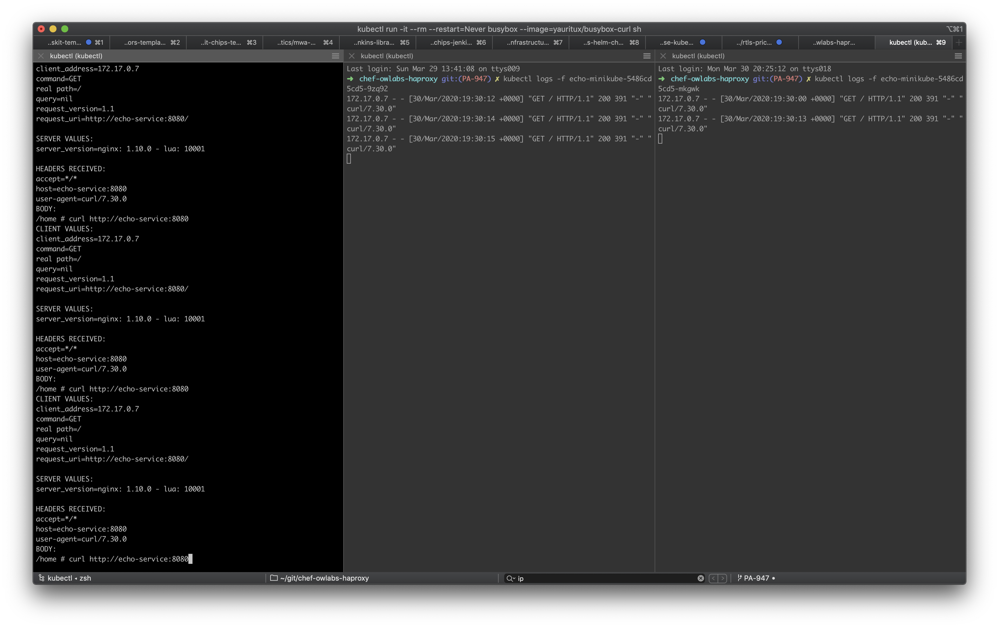
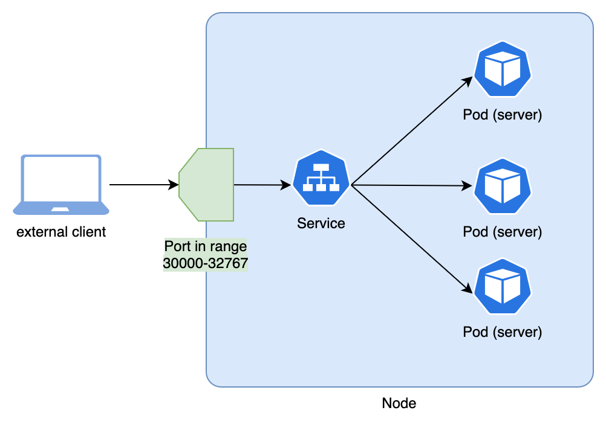
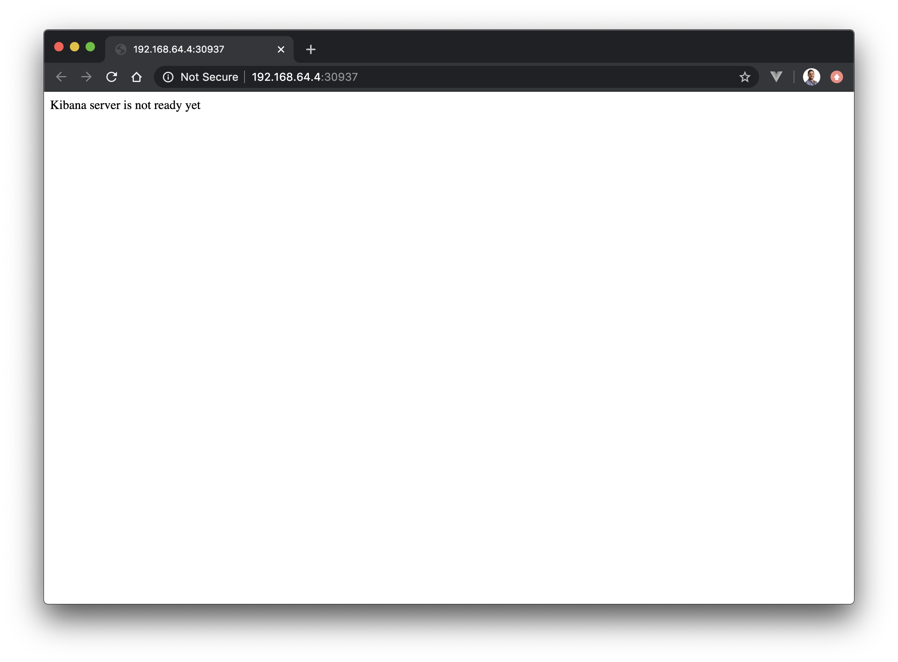
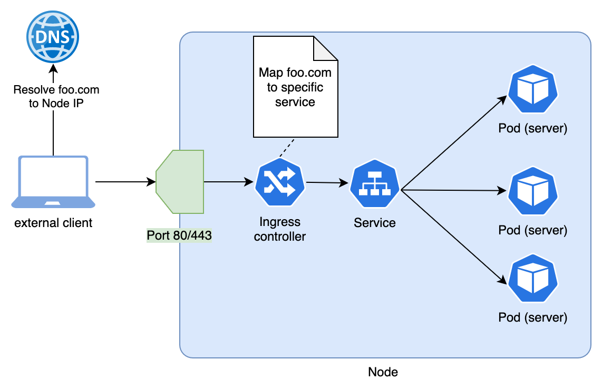
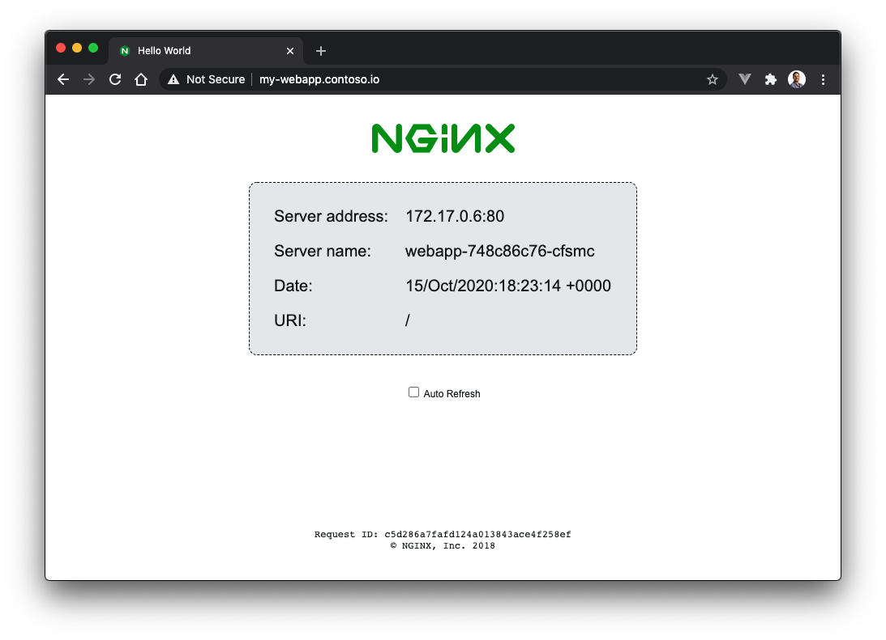

# Basic Networking

You should already have an HTTP echo server in your cluster, which we deployed by creating a `Deployment` in the [previous module](./2-basic-kubernetes-objects.md). If you don't, quickly create one using the shortcut:
```bash
kubectl create deployment echo-minikube --image=k8s.gcr.io/echoserver:1.4
```

## The problem with Pods

While we were able to test the server in the [previous module](./2-basic-kubernetes-objects.md), we came to the conclusion that it _felt_ wrong.

Let's make those problems even more obvious by editing the echo server `Deployment`, increasing the number of replicas from 1 to 2. We can easily do so via the `kubectl edit` command, which will open the `Deployment` YAML manifest in a text editor so you can update the replicas parameter:
```bash{1}
$ kubectl edit deployment echo-minikube

... editor opens. Update the replicas property, save and close

deployment.apps/echo-minikube edited
```

::: tip afraid if vi?
By default `kubectl` will open the YAML in the vi editor. You can configure a different one by editing an environment variable, for example use vscode with:
```bash
export KUBE_EDITOR='code --wait'
```
:::

If you now inspect the pods, you will see there are 2 Pods belonging to this deployment:
```bash{1}
$ kubectl get pod
NAME                             READY   STATUS    RESTARTS   AGE
echo-minikube-5486cd5cd5-nxgq2   1/1     Running   0          18m
echo-minikube-5486cd5cd5-qlrmx   1/1     Running   0          15m
```

Of course, each of them has its own different IP (note the IPs you get in your machine are likely to be different to the ones in this example)
```bash{1}
$ kubectl get pod --selector=app=echo-minikube -o jsonpath='{.items[*].status.podIP}'
172.17.0.5 172.17.0.6%
```

::: tip what is that dark magic?
The command above showcases some advanced `kubectl` functionality:
- You can pass a selector to the `kubectl get pod` command (like the label selector we use above).
- You can also format the output using [JSONPath](https://kubernetes.io/docs/reference/kubectl/jsonpath/) so you can extract specific fields, like the podIP (if you dont know the structure of the JSON document you can see the full JSON of any Kubernetes object as in `kubectl get pod my-pod -o json`)

You can take this even further and use an a more complex expression with the `jsonpath` parameter to do some basic formatting. For example, print each Pod in its own line and add labels to the printed fields as in:
```bash{1}
$ kubectl get pod --selector=app=echo-minikube -o jsonpath='{range .items[*]}{"PodName"}={.metadata.name}; {"PodIp"}={.status.podIP}{"\n"}{end}'
PodName=echo-minikube-5486cd5cd5-nxgq2; PodIp=172.17.0.5
PodName=echo-minikube-5486cd5cd5-qlrmx; PodIp=172.17.0.6
```
:::

If you now wanted to send a request to your echo server, to which of the 2 Pods would you send the request?

You would need to decide between sending a request to the replica listening at `http://172.17.0.5:8080` or the one at `http://172.17.0.6:8080`. This will immediately defeat the purpose of deploying multiple replicas!

On top of that, consider what will happen if these IPs change after redeploying the Pods? You would need to keep constantly checking what these IPs are so you can keep communicating with the Pods.

There must be a better way!

## Networking inside the cluster

### Service objects
To solve the problem described in the earlier section, we need a solution that:

- provides us with some internal DNS that let us resolve the IPs using a static value like a given name
- would automatically load balance across multiple Pods.

This is exactly the main usage of the Kubernetes [Service](https://kubernetes.io/docs/concepts/services-networking/service/) objects!

A standard `Service`:
- will provide you with a host name that you can use instead of the Pod IPs
- will automatically load balance requests across multiple Pods.

And how do you define one? Well, you guessed it, with another YAML manifest. For the most basic `Service` definition you need to provide:

- a `name` for the service, which **becomes the host name** by which the service is available
- a `selector` that matches the Pods you want to send the requests to
- a **port mapping** between ports in the service and ports in the Pod’s containers

Therefore, we can create a service that exposes the multiple instances of our echo server as follows:
```bash
$ cat <<EOF | kubectl apply -f -
apiVersion: v1
kind: Service
metadata:
  name: echo-service
spec:
  selector:
    app: echo-minikube
  ports:
  - port: 8080
    targetPort: 8080
EOF
```

Once the Service object is created, the cluster will:

- assign a new internal IP to the service
- update the cluster’s internal DNS so the host echo-service resolves to the IP assigned to the service
- Reply to requests on the service IP by load balancing them across both of the echo server Pods.

::: tip
That means you will be able to send requests to any of the echo server Pods by sending a request to `http://echo-service:8080`!
:::

::: warning Requests across namespaces
This might get unnoticed since we keep using the default namespace in the tutorial, so all the objects we are creating are in the same namespace. However, its worth knowing that:
- The `Service` must always be in **the same namespace** than the `Pods` it exposes.
- If the `Service` you are trying to reach is defined in a different namespace, you can still communicate by adding the Namespace to the host name, as in `http://echo-service.{my-namespace}:8080`.
- **Network policies** can be defined to restrict the traffic between different `Namespaces`. By default clusters don’t apply any restrictions!
:::

### Testing a service
Let’s verify the service is doing as expected and load balances the requests across the 2 Pods of our echo server. Open 3 separated terminals:

- In the first terminal, stream the logs of the first Pod (note the name of the Pod can be differnet in your local machine, so get it using `kubectl get pod`)
    ```bash
    $ kubectl logs -f echo-minikube-5486cd5cd5-9zq92
    ```
- In the second terminal, do the same for the second Pod
- In the third terminal, deploy a throwaway `busybox-curl` container and send multiple HTTP GET requests to the `http://echo-service:8080 URL`.
    ```bash{1,3}
    $ kubectl run -it --rm --restart=Never busybox --image=yauritux/busybox-curl sh
    If you dont see a command prompt, try pressing enter.
    / curl http://echo-service:8080
    ```

Notice how request reach both Pods!


## Networking outside the cluster

The previous section presented a much easier way of communicating with applications deployed to the cluster. However, it is a method restricted to traffic from within the cluster. If you try to open the URL `http://echo-service:8080` in your local browser, you won't receive a response!

This is because the `Service` we created is of the default type of service defined by Kubernetes, a **ClusterIP service**. As its name implies, this service receives its own IP which is also internal to the cluster (which you can see if you run ping echo-service inside the busybox container used at the end of the last section).

Therefore, the purpose of a **ClusterIP service** is to facilitate the communication between applications hosted in the cluster.

That’s also why Kubernetes defines other types of services and objects for different purposes, like allowing traffic from outside the cluster to reach the desired Pods and containers.

### NodePort services

Let's begin by exploring how to use a **NodePort service**. These are very frequently used during development and/or debugging, since they are a quick and easy way to expose a service (although not one you want to rely on for production purposes).

What a [NodePort service](https://kubernetes.io/docs/concepts/services-networking/service/#nodeport) does is to publish the service in a random port (by default, the range `30000-32767`, but this is configurable) of every one of the cluster's nodes (Remember, in the case of minikube there is a single Node).

Therefore, as long as you are in the same network than the node, you will be able to reach the service. The following diagram shows a simplified view of a NodePort service in a cluster with a single node:



Let's see how we can create one. As our test application, let's use a [Kibana](https://www.elastic.co/kibana) server rather than the echo-server we have used so far. You can easily create a `Deployment` to host kibana in our cluster using the images publicly available in Docker Hub:
```bash
$ kubectl create deployment kibana --image=kibana:7.6.1
```

The Pods will take a while to initialize since the container image needs to be pulled down from docker hub, but eventually you will see:
```bash{1}
$ kubectl get pod
NAME                     READY   STATUS    RESTARTS   AGE
kibana-9d6df8c77-qz6mk   1/1     Running   0          3m59s
```

Awesome, we have a Kibana server deployed to our cluster! Now let's expose its port `5601` so we can open it in the browser.

We can easily create a **NodePort service** using the `kubectl expose` command. This saves us from having to manually define the YAML manifest of the Service (Make sure to expose the default kibana port, `5601`)
```bash{1}
$ kubectl expose deployment kibana --port=5601 --type=NodePort
service/kibana exposed
```

If you inspect the service, you can see the random port in the 30000-32767 range in which the new NodePort service was exposed (alongside the cluster nodes’ IP):
```bash{1,3}
$ kubectl get service kibana
NAME     TYPE       CLUSTER-IP       EXTERNAL-IP   PORT(S)          AGE
kibana   NodePort   10.109.121.219   <none>        5601:30937/TCP   173m
```

From the output above, you can see the port in which the service been exposed, `30937`. Now you just need to combine this with the IP of one of the nodes of the cluster. When using minikube you can get it by running:
```bash{1}
$ minikube ip
192.168.64.4
```

This means you can now open `http://192.168.64.4:30937/` in your browser (Note that the exact IP and port is likely to be different in your machine). You should see a very unimpressive message _Kibana server is not ready yet_, since we never connected kibana to an [elasticsearch](https://www.elastic.co/products/elasticsearch) server!
- As an exercise, try to deploy an [elasticsearch](https://www.elastic.co/products/elasticsearch) server to the cluster and connect it to your kibana Deployment!

::: tip
Since we are using `minikube`, once a NodePort service is created you can simply use the following command to automatically open it in your browser:
```bash
$ minikube service kibana
```
:::

::: warning Following online in Katacoda?
If you are running in Katacoda, you won't be able to reach out the server returned by the `minikube ip` command. You also won't be able to open it in the browser using the `minikube service kibana` command.

Don't worry, instead you just need to:
- get the service port using `kubectl get service`
- Clicking the `+` icon at the top of the tabs, then click _Select port to view on Host 1_ from the menu
- A new browser tab will open. When prompted, enter the service port

Alternatively, you can just send a request using `curl`. From the Katacoda shell run:
```bash
$ curl $(minikube ip):31770
```
You should get a 503 response with the expected _Kibana server is not ready yet_ message.
:::



### Ingress

Every time a **NodePort** service is created, a random port is assigned to it. And each different service will get its own port assigned. This makes them great for quickly exposing a service during development/debugging, but not something you want to rely upon for your production workloads.

That is why Kubernetes provides another abstraction designing for exposing primarily HTTP/S services outside the cluster, the [Ingress](https://kubernetes.io/docs/concepts/services-networking/ingress/) object. With an Ingress, you can specify a map between a specific host name (like `my-service.my-company.io`) and a regular Kubernetes service.

::: tip
Before we can use an `Ingress` object with `minikube`, we need fist to enable the ingress addon:
```bash
$ minikube addons enable ingress
```
> If you are running in mac, you might need to recreate your minikube environment using `minikube start --vm=true`
:::

Let's see an example. This time we will use a simple web application in our test, so begin by creating a `Deployment` with:
```bash
$ kubectl create deployment webapp --image=nginxdemos/hello
```

Before we can create an Ingress, we need to create a regular `Service` like the ones we saw in the [networking inside the cluster section](#networking-inside-the-cluster). The container for this web application is listening on port `80`, so let's create a service like:
```bash
$ cat <<EOF | kubectl apply -f -
apiVersion: v1
kind: Service
metadata:
  name: webapp-service
spec:
  selector:
    app: webapp
  ports:
  - port: 80
    targetPort: 80
EOF
```

Now we have all the pieces in place to create our first [Ingress](https://kubernetes.io/docs/concepts/services-networking/ingress/) object. We are going to map the host name `my-webapp.contoso.io` to the service `webapp-service` we have just created. The service itself maps to the actual container running the web application:
```bash
$ cat <<EOF | kubectl apply -f -
apiVersion: networking.k8s.io/v1
kind: Ingress
metadata:
  name: webapp-ingress
spec:
  rules:
  - host: my-webapp.contoso.io
    http:
      paths:
      - path: /
        pathType: Prefix
        backend:
          service:
            name: webapp-service
            port:
              number: 80
EOF
```

:::warning
In versions **prior to Kubernetes 1.19**, the Ingress is defined with a different schema. The equivalent would be:
```
cat <<EOF | kubectl apply -f -
apiVersion: networking.k8s.io/v1
kind: Ingress
metadata:
  name: webapp-ingress
spec:
  rules:
  - host: my-webapp.contoso.io
    http:
      paths:
      - backend:
          serviceName: webapp-service
          servicePort: 80
EOF
```
Depending on the version, you might even need to use `apiVersion: extensions/v1beta1`.

Check your Kubernetes version by running `kubectl version` and look at the server version.
:::

You might be wondering, how is this going to enable traffic from outside the cluster? That is because in the Kubernetes cluster, we have an [Ingress controller](https://kubernetes.io/docs/concepts/services-networking/ingress-controllers/), that we just deployed when we enabled the minikuke ingress addon.
> Minikube adds the [NGINX Ingress controller](https://kubernetes.github.io/ingress-nginx/) when enabling the Ingress addon. If you inspect your cluster, you will see it in the `kube-system` namespace.

Let's see how the Ingress controllers work:
- This controller is deployed to every node of the cluster, and traditionally listens on ports 80/443.
- A request sent to port 80/443 of any node in the cluster is then handled by the `Ingress controller`.
- The controller will inspect the host name in the request (like `my-webapp.contoso.io` in a request like `http://my-webapp.contoso.io`), and call the relevant downstream service according to all the `Ingress` objects that were defined (ie, the `webapp-service` in our example)

The following diagram shows this process taking a simplified view of a cluster with a single node:


So all that is left to see our Ingress working is to create a DNS entry that points `my-webapp.contoso.io` to the IP of your cluster nodes. This is easy in our minikube environment since there is only a single node.
- Get the node IP using
    ```bash
    $ minikube ip
    192.168.64.4
    ```
- Update the hosts file of your local machine (found in `/etc/hosts` for Mac/Linux and `C:\Windows\System32\Drivers\etc\hosts` for Windows). Add a new entry like:
    ```bash
    192.168.64.4 my-webapp.contoso.io
    ```

:::tip
In production clusters, this is usually solved with a load balancer that sits in fronts of your nodes. The load balancer also listens on ports 80/443, and balances requests across all the nodes.

Therefore, you create DNS entries that map the desired host name with the IP of the _load balancer_.
:::

Once you save the modified hosts file, navigate to http://my-webapp.contoso.io in your browser. You should see the sample hello-world website in all its glory!


::: warning Following online in Katacoda?
If you are running in Katacoda, you won't be able to map its host file and test your Ingress the same way we did locally.

However you can send a request using `curl` from the Katacoda shell that simulates the change made to the local hosts file. Using the `--resolve` option we can manually tell curl to map `my-webapp.contoso.io` to the IP returned by `minikube ip`:
```bash
$ curl --resolve my-webapp.contoso.io:80:$(minikube ip) http://my-webapp.contoso.io
```
You should see the HTML page printed to the Katacoda shell.
:::

This concludes the networking basics. Together with the previous modules of the tutorial, you should now have a very strong base! In addition to feeling more comfortable using Kubernetes as a developer, this base should help you learning more advanced topics.

<tutorial-call-to-action-link title="Prev module" to="./2-basic-kubernetes-objects" />
<tutorial-call-to-action-link title="Next module" to="./4-persistent-volumes" />